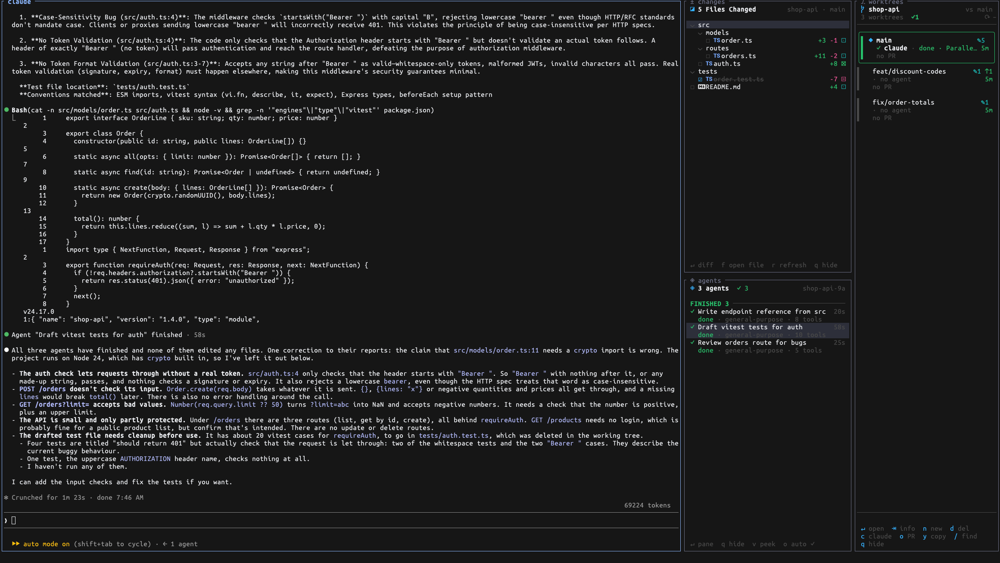

# Sidekick

Side panels for [herdr](https://herdr.dev) when you run coding agents in parallel:



- **⎇ worktrees**: every git worktree of the repo as a card, with its agents, changed-file count,
  ahead/behind and PR + CI status. Opens when the repo has 2+ worktrees.
- **± changes**: files changed vs HEAD in the checkout of the pane you are focused on, with +/-
  counts. Click a file for a full-file diff.
- **◈ agents**: the Claude Code subagents of the focused Claude pane, split into NEEDS YOU
  (approval, reported BLOCKED, failed), RUNNING and FINISHED. Click one to open its live
  transcript as a pane next to your Claude pane (up to 4, as a 2×2 grid). New subagents open on
  their own. herdr notifies you when one needs you, in any workspace.
- **Open file**: type a path in the repo, fuzzy like Ctrl+P (`aiapi` finds
  `apps/api/app/routers/ai/api.py`), and view it with syntax highlighting. `path:line` jumps to
  the line. Open it with `f` in the changes panel, the action **Sidekick: open file**, or
  Ctrl+click a file path in the terminal.

Panels open by themselves where they apply and follow the pane you work in.

## Install

```sh
herdr plugin install minhtran3124/herdr-sidekick
```

The install downloads a prebuilt binary for macOS (Apple Silicon, Intel) or Linux (x86_64,
arm64). Without one it builds from source, which needs [Rust](https://rustup.rs).

Needs herdr 0.9.1+, `git`, `jq` and `bash`. Optional: `gh` (logged in) for PR status, Claude
Code for the agents panel, a Nerd Font for file icons.

Optional tab-bar summary and sidebar PR row: run the action **Sidekick: add tab-bar summary**.
It adds a managed block to `~/.config/herdr/config.toml` and backs the file up first.

## Keys

Every panel moves with `j`/`k` or `↑`/`↓`, and the mouse wheel scrolls. Viewers (diff, file,
agent pane) also take `d`/`u` or PgDn/PgUp to page and `g`/`G` for top/bottom; `h`/`l` scroll
the diff and file viewers sideways.

### ⎇ Worktrees

| Key | Action |
|---|---|
| `↵` | Open the worktree |
| `⇥` / `space` | Show / hide details |
| `n` | New worktree (type a branch, `↵`) |
| `d` | Delete worktree (confirm with `y`) |
| `c` | Start Claude in it |
| `o` | Open its PR |
| `y` | Copy its path |
| `/` | Filter (`esc` clears) |
| `r` | Refresh |
| `q` | Hide panel |

### ± Changes

| Key | Action |
|---|---|
| `↵` / `l` | Open diff, or fold / unfold a folder |
| `h` | Fold folder |
| `f` | Open file picker |
| `r` | Refresh |
| `q` | Hide panel |

**In the diff**

| Key | Action |
|---|---|
| `]` / `[` | Next / previous file |
| `n` / `p` | Next / previous hunk |
| `e` | Show all lines / only changes |
| `q` / `esc` | Close |

### Open file

**Picker**

| Key | Action |
|---|---|
| *type* | Fuzzy filter; `path:line` jumps to the line |
| `↑` / `↓`, `⇥`, `^N` / `^P` | Select |
| `↵` | Open |
| `^U` | Clear |
| `esc` | Close |

**Viewer**

| Key | Action |
|---|---|
| `:` | Go to line |
| `/` | Find |
| `n` / `N` | Next / previous match |
| `esc` | Back to picker |
| `q` | Close |

### ◈ Agents

| Key | Action |
|---|---|
| `↵` | Open as a pane |
| `v` / `space` | Peek (overlay) |
| `c` | Close all agent panes |
| `o` | Auto-open on / off |
| `a` | Hide / show finished |
| `p` | Show agents from before a resume |
| `r` | Refresh |
| `q` | Hide panel |

**Agent pane**

| Key | Action |
|---|---|
| *click* | Expand a tool call |
| `o` | Expand all tool calls |
| `t` | Show / hide thinking |
| `G` | Follow new output |
| `q` / `esc` | Close |

> `q` on a panel hides it in every tab and stops it auto-opening. Bring it back with the action
> **Sidekick: toggle worktrees / changes / agents**.

## Settings

Copy `config.env.example` to `$(herdr plugin config-dir minhtran3124.sidekick)/config.env`.
Widths, the worktree threshold, the `gh` path and the Claude config dir can be changed there.

## Notes

- Agent panes are read-only. A subagent runs inside its parent Claude process, so there is no
  terminal to type into; message it from the parent instead.
- The agents panel reads Claude Code's transcripts under `~/.claude/projects/`. Nothing is sent
  anywhere.

## Development

```sh
cargo build --release
herdr plugin link "$PWD"      # link skips [[build]]; target/release/sidekick is used directly
cargo test --release
```

Check a panel without herdr: `sidekick changes --snapshot 44x20`,
`AGENTS_SESSION=<session id> sidekick agents --snapshot 44x30`,
`HERDR_WORKSPACE_ID=<id> sidekick board --snapshot 38x40`.

Release: bump `version` in `herdr-plugin.toml` and `Cargo.toml`, then push a `v<version>` tag.
`.github/workflows/release.yml` builds and attaches the four binaries that the install downloads.
